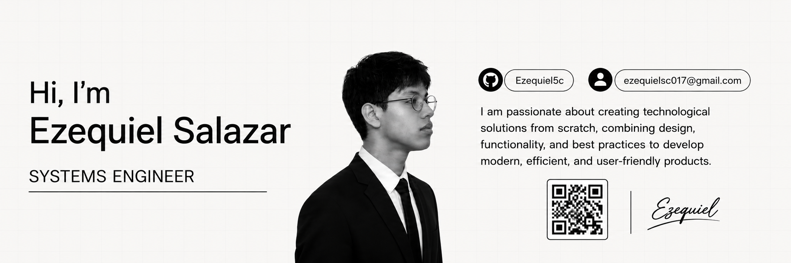

# My Portfolio README

  

<h1 align="center">My Portfolio</h1>

  Building ideas into real-world digital solutions.

  

 

  

  ✨ Turning ideas into impactful digital solutions.

---

## 🚀 Tech Stack

  

  

---

## 🔗 Let's Connect

&nbsp;&nbsp;

