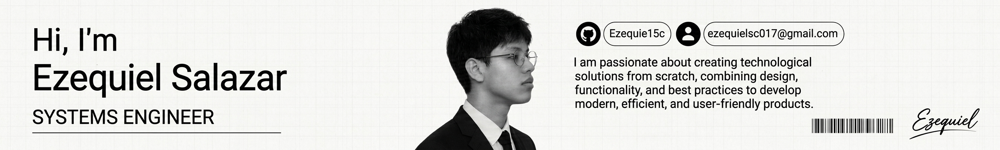

# My Portfolio README

  

<h1 align="center">📂 My Portfolio</h1>

  Building ideas into real-world digital solutions.

  

 

  

<h3 align="center">
  ✨ Turning ideas into impactful digital solutions.
</h3>

---

## 🚀 Tech Stack

&nbsp;&nbsp;

&nbsp;&nbsp;

&nbsp;&nbsp;

&nbsp;&nbsp;

&nbsp;&nbsp;

&nbsp;&nbsp;

&nbsp;&nbsp;

  

&nbsp;&nbsp;

&nbsp;&nbsp;

&nbsp;&nbsp;

&nbsp;&nbsp;

  

&nbsp;&nbsp;

&nbsp;&nbsp;

&nbsp;&nbsp;

&nbsp;&nbsp;

---

## 📫 Let's Connect

&nbsp;&nbsp;

